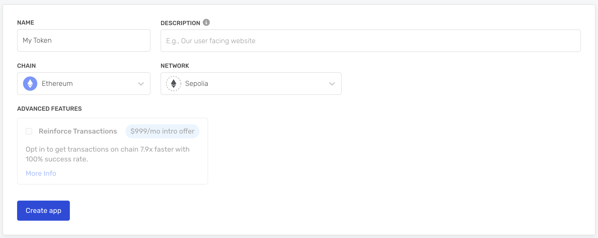
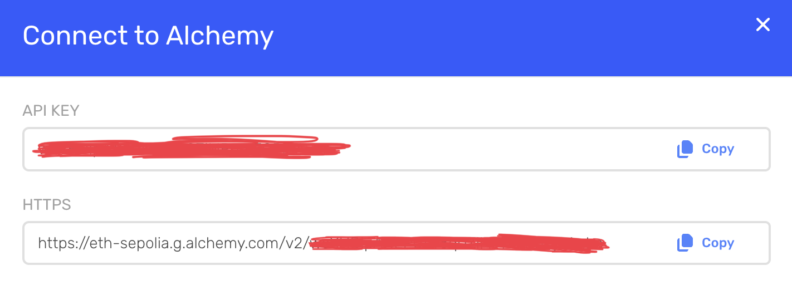
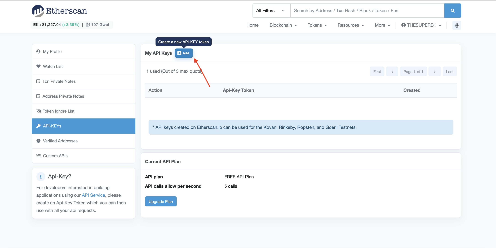

# The Media DAO

This project is a smart contract that acts as a bank and mints new ERC-20 tokens when users send Ether to the contract address. The contract has customizable features that can be modified to fit your requirements.

## How the contract works

1. The person who originally deployed the contract is considered an "owner".
2. When users send ether to the contract address, the smart contract mints new ERC-20 tokens to the sender. The amount of tokens sent to the sender is determined by the token price.
3. The token price is set by the "owner" of the contract and can be updated by calling the `setPrice()`  function with a numeric value representing the price on one ether, such as `1000000000000000000n`.
4. The token supply is unlimited, but the owner can toggle the ability for the bank to mint new tokens using the `pause()` and `unpause()` functions.
5. The current token price can be retrieved by calling `getPrice()`.
6. Whenver the contract is paused, unpaused, or the token price is changed, the events are emitted for on-chain visibility.
7. The ""owner"" can withdraw Ether that was sent to the contract by users who purchased the ERC-20 tokens.

## Setup

1. Install the dependencies with NPM install.

`bash npm install`

2. Compile the contract with 

`bash npx hardhat compile`

3. Run Tests with

`shell REPORT_GAS=true npx hardhat test --network hardhat`

## Customization

1. Navigate to `contracts` directory and open the file named `Token.sol`
&nbsp;
2. Change the token name and symbol by editing the following line and replacing `Token`  and `TKN` with the values of your choosing.
`solidity constructor(uint256 initialMint, uint256 initialPrice) ERC20("Token", "TKN")` {
3. Open up `scripts/deploy.ts` and change the following line to suit your requirements.
`solidity const token = await Token.deploy(100, ethers.utils.parseEther("0.05"));`
The first number represents the number of tokens to be sent to the contract deployer (pre-mint). The second number represents the initial token price when purchased form a Bank (0.05 ether).
4. Open up `scripts/etherscan-arguments.js` and modify the arguments to match the values from step 4. 
 Note that the second value is in **Wei**.
`javascript module.exports = [100, 50000000000000000n]`

## Deployment
In this example we will be deploying to [Sepolia Testnet](https://www.alchemy.com/overviews/sepolia-testnet).

### Getting the API Keys
#### Alchhemy
1. Signup for a free [Alechemy](https://alchemy.com/ "Alchemy") account.
2. On the menubar, click **Apps** -> **Create App**.
3. Ensure that the new app you are creating is using **Sepolia** network.
 

4. After the app has been created click on the **View Keys** button located underneath the main navigation.

5. Create `.env` file in the root directory and populate it with the **API_KEY** with value from **API_KEY** and **API_URL** with the value from the HTTPS section.
`bash API_KEY = "API_KEY" API_URL = "https://eth-sepolia.g.alchemy.com/v2/API_KEY"`

----

#### Etherscan
1. Visit [etherscan.io](https://www.etherscan.io) and signup for a [free_account](https://etherscan.io/register "free account").
2. Once logged in, press your username on the top right, and select the **My profile** button.
3. Click on the **API-KEY** button on the left hand side and then press the **Add** button.
 

4. Add the API key to the **.env** file you've created in the previous step.
`bash ETHERSCAN_API_KEY = "YOUR_API_KEY"`

### Deploying to Blockchain
`shell npx hardhat run scripts/deploy.ts --network sepolia`

If successful this will return deployed **CONTRACT ADDRESS**.

`bash Deployed to 0x562B9B7BE96E1687DA93589db0568d80Ec0dADB6`

### Upload to Etherscan
Next thing to do is to upload the contract to etherscan so people can read the actual code.

Replace **CONTACT_ADDRESS** with contract address from previous step.
`bash npx hardhat verify --constructor-args scripts/etherscan-arguments.js  --network sepolia CONTRACT_ADDRESS`

## Acknowledgements
[Alchemy_ERC-20_Tokens_Tutorial](https://docs.alchemy.com/docs/erc-20-tokens "ERC-20)

## Contributing

Contributions are always welcome!

See `contributing.md` for ways to get started.

Please adhere to this project's **Code of Conduct**.

## License
[MIT](https://choosealicense.com/licenses/mit/ "MIT")